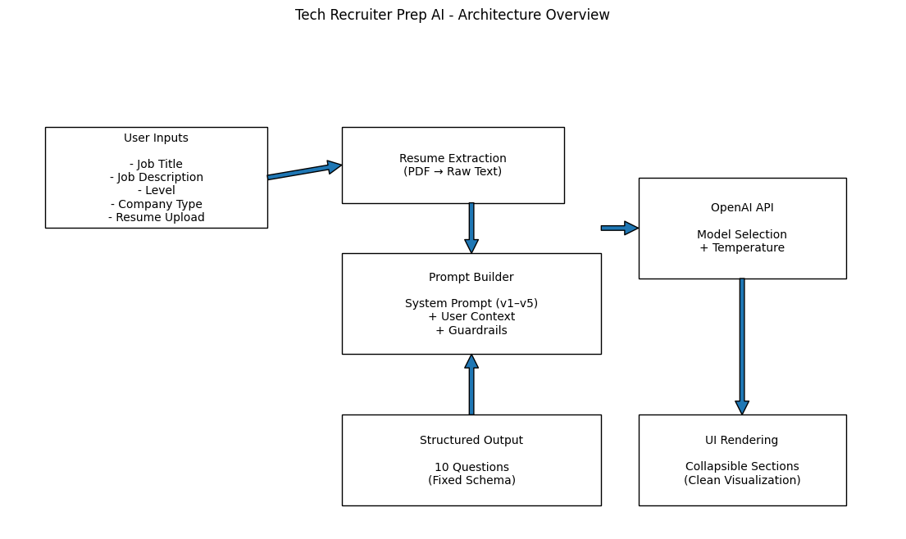

# Tech Recruiter Prep AI

A single-page Streamlit application that generates structured first-round **technical recruiter screening questions** and concise, recruiter-ready answers using OpenAI.

This tool helps candidates prepare for the initial recruiter conversation by aligning responses to:
- Job Title
- Job Description
- Candidate Level
- Company Type (Startup / Enterprise)
- Uploaded Resume (PDF)

---

## 🚀 Features

- 📄 Resume upload (PDF → raw text extraction)
- 🎯 10 structured recruiter-style questions
- 🧠 Tailored answers aligned to JD + resume
- 🎛 Creativity control (temperature tuning)
- 🤖 Configurable OpenAI model selection
- 🔒 Anti-fabrication security guard
- 🧪 Internal prompt experimentation (5 techniques)

---

## 🏗 Architecture Overview



```mermaid
flowchart TD
    U[User] -->|Upload Resume (PDF)| S[Streamlit UI]
    U -->|Paste JD Title + Description| S
    U -->|Select Level + Company Type| S
    U -->|Choose Model + Creativity| S

    S --> P[Input Processing\nPDF Text Extraction]
    P --> G[Prompt Builder\n(5 System Prompt Variants)]
    G --> O[OpenAI API\nModel + Temperature]
    O --> R[Response Parser\n10 Structured Q&A]
    R --> S

    S -->|Expandable Sections| U

    S --> SG[Security Guard\nNo Fabrication Policy]
    SG -->|Validate / Sanitize| S
